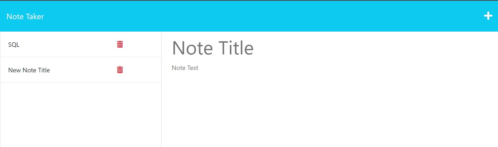

  # Note Taker

  [](https://opensource.org/licenses/MIT)

  ## Description
  This application called Note Taker can be used to write and save notes. This application will use an Express.js back end and will save and retrieve note data from a JSON file.

  Here's what the application looks like:

  

  ---

  ## Table of Contents

  * [Installation](#installation)
  
  * [Usage](#usage)

  * [License](#license)

  * [Contributing](#contributing)

  * [Tests](#tests)

  * [Questions](#questions)

  ---

  ## Installation

  To install necessary dependencies, run the following command:
  ```md
  npm i
  ```
  ---

  ## Usage
  run npm start to start running the application

  ---

  ## License
  This project is licensed under the MIT license.

  ---

  ## Contributing
  To contribute to this application, create a pull request.

  ---

  ## Tests
  To run tests, run the following command:
  ```md
  npm test
  ```
  ---

  ## Questions
  If you have any questions about the repo, open an issue or contact me directly at diegoborjas@gmail.com. You can find more
  of my work at [diegoaborjas](https://github.com/diegoaborjas)

